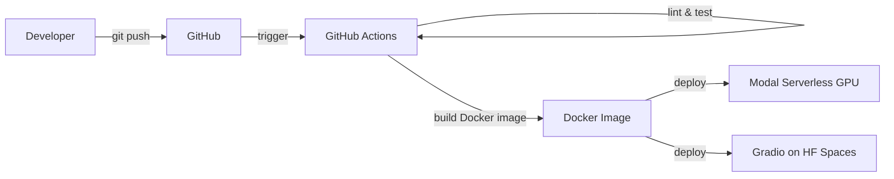
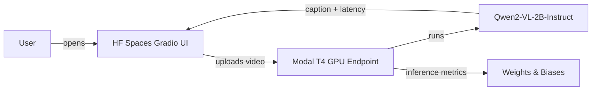

# VLM Action Captioning

[](https://github.com/abalikhan/vlm-action-captioning/actions/workflows/ci.yaml)
[](https://abalikhan--vlm-action-captioning-api.modal.run/docs)
[](https://huggingface.co/spaces/abidali1128/vlm-action-captioning)
[](https://www.python.org/downloads/release/python-3110/)

Fine-tuned Qwen2-VL-2B for video action understanding and captioning,
with full MLOps pipeline.

## Stack

Training: PyTorch, PEFT/QLoRA, Weights and Biases, Kaggle T4
Serving: vLLM, FastAPI, Modal.com serverless GPU
CI/CD: GitHub Actions, Docker, ECR
Demo: Hugging Face Spaces, Gradio
Registry: AWS SageMaker Model Registry

## Architecture

### CI/CD Pipeline



### Inference Request Flow



## Results

| Model | Hardware | Latency (p50) |
|---|---|---|
| Qwen2-VL-2B-Instruct | Local — Quadro RTX 3000 | 3340 ms |
| Qwen2-VL-2B-Instruct | Modal T4 GPU | ~500 ms |

## Live Demo

- **Gradio demo:** <https://huggingface.co/spaces/abidali1128/vlm-action-captioning>
- **API docs:** <https://abalikhan--vlm-action-captioning-api.modal.run/docs>

## Project Structure

```
vlm-action-captioning/
├── training/               # Training scripts, QLoRA fine-tuning config
│   └── scripts/            # Entry-point scripts for local and cloud training
├── serving/
│   ├── app/                # FastAPI application and inference logic
│   ├── modal/              # Modal serverless GPU deployment definitions
│   └── gradio/             # Gradio demo app deployed to HF Spaces
├── evaluation/             # Evaluation scripts and metric computation
├── infra/
│   ├── docker/             # Dockerfiles for serving and CI images
│   └── sagemaker/          # AWS SageMaker model registry integration
├── tests/                  # Unit and integration test suite
├── .github/
│   └── workflows/          # GitHub Actions CI/CD pipeline definitions
└── notebooks/              # Exploratory analysis and experiment notebooks
```

## Quickstart

```bash
git clone https://github.com/abalikhan/vlm-action-captioning.git
cd vlm-action-captioning
python -m venv .venv && source .venv/bin/activate
uv pip install -e ".[dev]"
make test
make serve-local
# In a separate terminal:
curl -X POST http://localhost:8000/caption/upload \
  -F "file=@your_video.mp4"
```

## How to Reproduce

```bash
# 1. Clone and set up environment
git clone https://github.com/abalikhan/vlm-action-captioning.git
cd vlm-action-captioning
python -m venv .venv && source .venv/bin/activate
uv pip install -e ".[dev]"

# 2. Run the test suite
make test

# 3. Start the inference server locally
make serve-local

# 4. Test the local API endpoint
curl -X POST http://localhost:8000/caption/upload \
  -F "file=@your_video.mp4"
```

## Deployment

Every push to `main` triggers the GitHub Actions pipeline automatically:

1. **Lint & test** — ruff linting and the full pytest suite must pass
2. **Deploy to Modal** — the FastAPI inference service is deployed to Modal serverless GPU (T4)
3. **Deploy to HF Spaces** — the Gradio demo is pushed to Hugging Face Spaces

No manual deployment steps are required; merging to `main` is the deploy.
