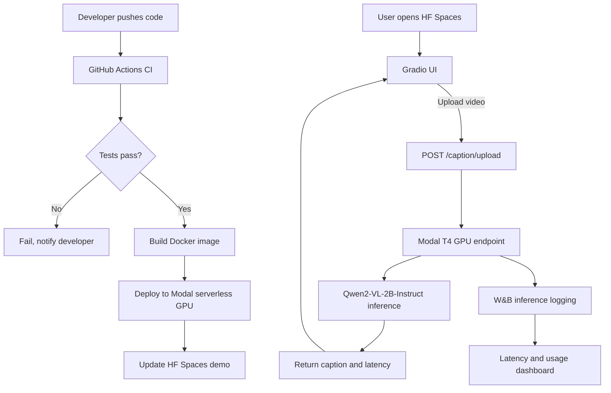

## System Architecture

```mermaid
flowchart TD
    A[Developer pushes code] --> B[GitHub Actions CI]
    B --> C{Tests pass?}
    C -- No --> D[Fail, notify developer]
    C -- Yes --> E[Build Docker image]
    E --> F[Deploy to Modal serverless GPU]
    F --> G[Update HF Spaces demo]

    H[User opens HF Spaces] --> I[Gradio UI]
    I -- Upload video --> J[POST /caption/upload]
    J --> K[Modal T4 GPU endpoint]
    K --> L[Qwen2-VL-2B-Instruct inference]
    L --> M[Return caption and latency]
    M --> I

    K --> N[W&B inference logging]
    N --> O[Latency and usage dashboard]
```